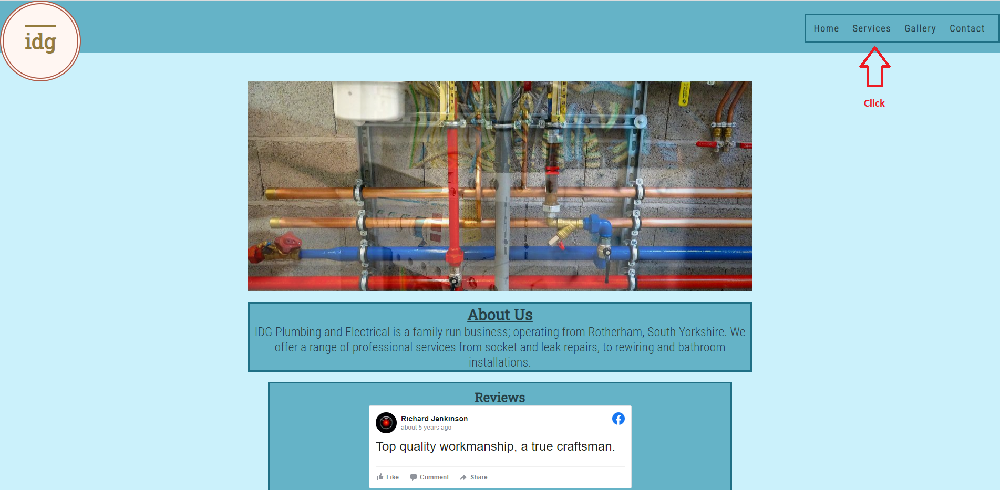

# IDG Plumbing and Electric

IDG Plumbing and Electric (IDG) is a small, family-run business operating in South Yorkshire, England.
This site will be used to promote and advertise the business to prospective users and clients and will provide information to them about the range of services the business offers.

(Developer: Stuart Wall)

[Live Website](https://clinelly.github.io/CI_PP1_IDG/)

## Table of Content

1. [Project Goals](#project-goals)
    1. [User Goals](#user-goals)
    2. [Site Owner Goals](#site-owner-goals)
2. [User Experience](#user-experience)
    1. [Target Audience](#target-audience)
    2. [User Requrements and Expectations](#user-requrements-and-expectations)
    3. [User Stories](#user-stories)
3. [Design](#design)
    1. [Design Choices](#design-choices)
    2. [Colour](#colours)
    3. [Fonts](#fonts)
    4. [Structure](#structure)
    5. [Wireframes](#wireframes)
4. [Technologies Used](#technologies-used)
    1. [Languages](#languages)
    2. [Frameworks & Tools](#frameworks-&-tools)
5. [Features](#features)
6. [Testing](#validation)
    1. [HTML Validation](#HTML-validation)
    2. [CSS Validation](#CSS-validation)
    3. [Accessibility](#accessibility)
    4. [Performance](#performance)
    5. [Device testing](#performing-tests-on-various-devices)
    6. [Browser compatibility](#browser-compatability)
    7. [Testing user stories](#testing-user-stories)
8. [Bugs](#Bugs)
9. [Deployment](#deployment)
10. [Credits](#credits)
11. [Acknowledgements](#acknowledgements)

## Project Goals

The ultimate goal of the project is to create a website for a small business and showcase their services; bringing them new customers and helping expand their business.

### User Goals
- Being able to find a local tradesman.
- Being able to see what services they provide.
- Being able to contact the tradesman quickly in case of an emergency.
- Being able to ask the business questions about prices. 
- Being able to see previous customer reviews and pictures of completed work.

### Site Owner Goals
- Being able to advertise the business.
- Being able to increase the number of customers.
- Being able to provide customers with an easy way to contact the business.
- Being able to explain to customers what services the business provides.
- Being able to show to customers what previous project have been completed.

## User Experience

### Target Audience 

- People who need a plumber/electrician in an emergency.
- People who are looking for a plumber/electrician to carry out routine or planned work.
- People who may be looking for inspiration or ideas for home improvements.
- Organisations who may be looking to contract a new tradesman.

### User Requrements and Expectations

### User Stories
The main service provided by IDG is a utility repair service. This means that there's some scope for expansion for the typical first-time/returning/frequent user stories. These could be expanded into emergency users, planned users, contracted users. These definitions are interchangeable and not mutually exclusive; a contracted user may be a first-time user but may actively be looking for similar key requirements that a frequent user would.
 
#### First Time Users / Emergency User
 
A first time user would be a user who is looking for utility work through a search engine and finds IDG's website, having never previously visited. An emergency user is someone who requires IDG's services in a time-sensitive manner. Therefore, their key requirements are:
 
1. To easily understand the main purpose of the site and learn more about the organisation.
2. To be easily able navigate throughout the site to find content.
3. To look for testimonials from other users and find out what they think of the service provider and see if they are trusted.
4. To locate their social media links to see the organisations' followings on social media to determine how trusted and known they are.
5. To quickly and easily contact the service provider and utilise their services.
 
#### Returning Users / Planned User
 
A returning user is likely to be a user who has used IDG's services and is returning for further work. A planned user is a user who has carried out previous research into the services they require before finding IDG, or be someone who has had IDG reccommended to them. Their key requirements are:

6. To find information about additional services.
7. To find the best way to get in contact with the organisation with any questions I may have.
8. To find ideas and inspirations.
 
#### Frequent User / Contract User
 
A frequent user is someone who utilises IDG's services on a regular basis. A contracted user could be an organisation that works alongside IDG or has them on their books. Their key requirements would be:

9. To check to see if the gallery has been updated with new work.
10. To check to see if there are any new reviews.
11. To be informed if the service provider is continuing to trade.

## Design

### Design Choices

The website was designed around the idea of a utility service. A monochrome scheme was used to attempt to convey a sense of modern professionalism; the colour choices and geometric shapes focus on the utilitarian aspect of the business.

### Colour

- For the colour scheme, I wanted to convey a sense of professionalism and a link to the plumbing aspect of the business. I chose a monochrome scheme, centered around a light blue background, with darker grey colours providing contrast for borders and text.

- During testing, it was found that the contrast between the text and background colours was not sharp enough; leading to accessibility problems. I put the main scheme back into the colour wheel and darkened it to provide a sharper text colour.

- Finally, I wanted the logo to 'pop' from the screen to catch the user's eye and highlight the electrical side of the business using contrasting, bright colours.

### Fonts

Roboto Slab was used for the headings and Roboto Condensed for the body. Sans Serif was chosen as a back-up font.
 
Roboto was chosen because it fit with the utilitarian asthetic of the website. Slab was used for the headings to provide greater definition over the Condensed body font.

### Structure

The website has a generic layout, used across the internet. This is to convey a sense of familiarity and prevent a frustrating user experience by having a complex, unfamiliar layout. The header contains the company logo in the top right of the screen, with a navigation bar in the top left. The main content is displayed in the main body in the centre of the screen. The footer is located at the bottom of the webpage and contains direct links to related external media.

The website has four pages:
- The Home page, which provides user with a basic outline about the company.
- The Services page, which goes into detail about what the company offers and what users can expect.
- The Gallery page, which provides users with images and pictures of what the company can provide and has accomplished in the past.
- The Contact page, which allows the user to provide their personal details and a detailed query to the company for a tailored response.

### Wireframes

Home

Services

Gallery

Contact

## Technologies Used

### Languages

- HTML 
- CSS

### Frameworks & Tools

- Git
- GitHub
- GitPod
- Balsamiq
- Google Fonts
- Adobe Colour
- Font Awesome
- Favicon.io
- Google Chrome Developer Tools

## Features

This website consists of four pages and 12 features.

### Existing Features
 
**Logo**
 
The Logo in the top left of the page is an important advertisement of the company to the users. It is repeated across all the pages in a uniform location.

 
**Navigation Bar**
 
Located in the top left of the Home, Services, Gallery and Contact pages, the bar provides users with the ability to efficiently navigate the site to browse for relevant content. It also allows users to navigate backwards through the site without having to use the browser-based back button or keyboard shortcuts.

User Stories Covered: 2

 
**Main Image**
 
The main images provide users with a visual representation of the type of services that IDG offers. This can reassure users that they are on the relevant website if they require a utilities service. The images are animated to shift between two pictures, providing visual feedback to the user.

User Stories Covered: 1

 
**About Us**
 
A small paragraph that describes IDG. It provides users with information about IDG, the services it provides and the location it operates in.

User Stories Covered: 1

 
**Reviews**
 
A number of positive reviews taken from IDG's Facebook page, providing users with real feedback from other users who have used IDG's services.

User Stories Covered: 3, 10, 11

 
**Media Links**
 
Featured at the bottom of the page, throughout the website, a series of images provide users with links to external websites for their own research.
* Facebook: A link to IDG's Facebook page, featuring more reviews, pictures and updates.
* Email: Opens up a 'mail:to' link, direct to IDG's email account.
* Phone: Opens up a 'tel:' link to IDG's phone number - ideal for emergency users.
* Checkatrade: Opens up a link to IDG's Check'a'trade webpage.

User Stories Covered: 4, 5, 7

 
**Our Services**
 
A small paragraph outlining IDG's services.

User Stories Covered: 1, 6, 8

 
**Electrical and Plumbing Services**
 
An overview list of specific services available to users. Featured over relevant imagery to catch the user's attention.

User Stories Covered: 1, 6, 8

 
**Electrical and Plumbing Services Pt.2**
 
A detailed breakdown of each service provided and a descriptive paragraph to help sell the service to the user, or help them match their specific requirement.
Provided in a display element to help reduce information overload and provide an element of interaction to the user.

User Stories Covered: 1, 6, 8

 
**Gallery**
 
A gallery of photographs from jobs IDG has performed in the past. It is designed to show users the quality of work they can expect and to provide ideas and inspirations.

User Stories Covered: 8, 9, 11

 
**Contact Form**
 
A form system where users can get in touch with IDG. Users will be able to describe their requirements, ask questions, arrange meetings or ask for job quotes.
Users will be asked to provide their names and contact information.

User Stories Covered: 5, 6, 7

**Contact Details and Location**

A small section where the user can find the direct contact details for IDG, as well as their location on Google Maps.

User Stories Covered: 5, 6, 7

### Features to be Implemented

## Testing

### HTML Validation

The W3C Markup Validation Service was used to check the validity of the HTML used across the website.
A number of errors were flagged; however, these were recorded as part of the Facebook code for the embedded reviews. No errors were shown with regard to my custom HTML.
Two warnings were flagged:
 - Sections lacking headings. These sections were used to house images as a background and did not require headings.
 - ARIA-Label. An ARIA-Label was placed on the contact links in the footer for accessibilty.

Home

Services

Gallery

Contact

### CSS Validation

The W3C CSS Validation tool was used to check the validity of the CSS code used for the website. No errors or warnings were returned.

Home

### Accessibility

The WAVE WebAIM accessibility tool was used to evaluate the website's accessibility.
One error was returned, which linked to the 'tel:to' external link in the footer. WebAIM claimed the link was empty, but user interation generates a phone call through an app or mobile device, and does not navigate away from the page. The telephone number linked is a fake number.

Home

Services

Gallery

Contact

### Performance

Google Lighthouse in Google Chrome Developer Tools was used to test the performance of the website. 

Home

Services

Gallery

Contact

### Device testing

The website was tested on the following devices:
- Google Pixel 6
- iPhone 11 Pro
- Acer Chromebook 314

### Browser compatibility

The website was tested on the following broswers:
- Microsoft Edge
- Mozilla Firefox
- Google Chrome

### Testing user stories

1. To easily understand the main purpose of the site and learn more about the organisation.

| **Feature** | **Action** | **Expected Result** | **Actual Result** |
|-------------|------------|---------------------|-------------------|
| Main Image | Navigate to the Home page and locate the main image  | View the main image | Works as expected |
| About Us | Navigate to the Home page and scroll down to find the About Us section | Locate the About Us section | Works as expected |

Screenshots

2. To be easily able navigate throughout the site to find content.

| **Feature** | **Action** | **Expected Result** | **Actual Result** |
|-------------|------------|---------------------|-------------------|
| Navigation Bar | On any page, locate the nav bar in the top-right corner and click on a page link. | Navigation bar is visible on each page, the links are active and will take you to a new page. | Works as expected |

Screenshots

3. To look for testimonials from other users and find out what they think of the service provider and see if they are trusted.

| **Feature** | **Action** | **Expected Result** | **Actual Result** |
|-------------|------------|---------------------|-------------------|
| Reviews | Navigate to the Home page. Scroll down to locate the Review section. Locate the Facebook reviews. | Facebook reviews are visible. | Works as expected |

Screenshots

4. To locate their social media links to see the organisations' followings on social media to determine how trusted and known they are.

| **Feature** | **Action** | **Expected Result** | **Actual Result** |
|-------------|------------|---------------------|-------------------|
| Media Links | On any page, scroll down to locate the Footer section. Click on the Facebook or Tick logo. | Media Links take you to external Social Media sites. | Works as expected |

Screenshots

5. To quickly and easily contact the service provider and utilise their services.

| **Feature** | **Action** | **Expected Result** | **Actual Result** |
|-------------|------------|---------------------|-------------------|
| Media Links | On any page, scroll down to locate the Footer section. Click on the Envelope or Telephone. | Envelope generates an email, Telephone generates a phone call. | Works as expected |
| Contact Form | Navigate to the Contact page and scroll down to find the Contact Form. | Locate and populate the Contact Form | Works as expected |

**NB:**The telephone number used is a non-functioning phone number, so it will not generate a phone call. The website also has no functioning back-end, so the Contact Form is non-functional at this moment in time.

Screenshots

6. To find information about additional services.

| **Feature** | **Action** | **Expected Result** | **Actual Result** |
|-------------|------------|---------------------|-------------------|
| Our Services | Navigate to the Services page and locate the Our Services section. | Our Services section is visible and provides a description of the business. | Works as expected |
| Electrical & Plumbing Services | Navigate to the Services page and locate the Electrical and Plumbing Services, located. | Lists are visible and provide the user with an outline of services provided. | Works as expected |
| Electrical & Plumbing Services Pt.2 |  Navigate to the Services page and scroll down to the collapsible sections. | Click on an item to view a detailed description. | Works as expected |

Screenshots

7. To find the best way to get in contact with the organisation with any questions I may have.

| **Feature** | **Action** | **Expected Result** | **Actual Result** |
|-------------|------------|---------------------|-------------------|
| Contact Form | Navigate to the Contact page and scroll down to find the Contact Form. | Locate and populate the Contact Form | Works as expected |
| Contact Details | Navigate to the Contact page and scroll down to find the Contact Details. | Direct Contact Details and a map to the business location are visible. | Works as expected |

Screenshots

8. To find ideas and inspirations.

| **Feature** | **Action** | **Expected Result** | **Actual Result** |
|-------------|------------|---------------------|-------------------|
| Gallery | Navigate to the Gallery page and scroll down to view all the images. | All images from work completed are visible.| Works as expected |
| Electrical & Plumbing Services Pt.2 |  Navigate to the Services page and scroll down to the collapsible sections. | Click on an item to view a detailed description. | Works as expected |

Screenshots

9. To check to see if the gallery has been updated with new work.

| **Feature** | **Action** | **Expected Result** | **Actual Result** |
|-------------|------------|---------------------|-------------------|
| Gallery | Navigate to the Gallery page and scroll down to view all the images. | All images from work completed are visible.| Works as expected |

Screenshots

10. To check to see if there are any new reviews.

| **Feature** | **Action** | **Expected Result** | **Actual Result** |
|-------------|------------|---------------------|-------------------|
| Reviews | Navigate to the Home page. Scroll down to locate the Review section. Locate the Facebook reviews. | Facebook reviews are visible. | Works as expected |

Screenshots

11. To be informed if the service provider is continuing to trade.

| **Feature** | **Action** | **Expected Result** | **Actual Result** |
|-------------|------------|---------------------|-------------------|
| Reviews | Navigate to the Home page. Scroll down to locate the Review section. Locate the Facebook reviews. | Facebook reviews are visible. | Works as expected |
| Gallery | Navigate to the Gallery page and scroll down to view all the images. | All images from work completed are visible.| Works as expected |
| About Us | Navigate to the Home page and scroll down to find the About Us section | About Us section is up to date | Works as expected |

Screenshots

## Bugs

| **Bug** | **Fix**|
|-------------|------------|
| Contact button would not change colour when hovered over. | Corrected colour and fixed hover attribute. |
| Escape link on 404 page did not work. | Fixed link to return to the home page. |
| When viewed on tablet, footer on services page was colliding with the services list. | Add margins to services list to space them out.|
| Complete lack of responsive design when viewed on mobile phones. | Fixed syntax errors in media query.|
| Users could submit a blank form. | Add 'required' attributes to form inputs.|
| Footer links jumped to two lines when viewed on smaller devices. | Added a media query to reduce margins and icon size.|
| Images in the gallery did not show up. | Fixed image filepaths.|

## Deployment

The following steps were used to deploy the website using GitHub Pages:

- In the GitHub repository, navigate to the 'Settings' tab.
- On the left hand menu select 'Pages'.
- For the source, select 'Branch: Master'.
- The webpage will refresh automatically. A banner will display: "Your site is published at: https://clinelly.github.io/CI_PP1_IDG/".
- After a few minutes, the live website will build and deploy.

In order to fork the repository, you must:

- Go to the GitHub repository.
- Click on 'Fork' button in upper right hand corner.
- Select 'Create new fork' from the drop-down menu.

You can clone the repository by:

- Going to the GitHub repository.
- Clicking the 'Code' button, loacted above the file list.
- Selecting if you prefer to clone using either HTTPS, SSH, or Github CLI.
- Clicking the copy button to copy the URL to your clipboard.
- Opening Git Bash.
- Changing the current working directory to one where you want to clone the directory to.
- Typing 'git clone' and pasting the URL from the clipboard ($ git clone https://github.com/YOUR-USERNAME/YOUR-REPOSITORY)
- Pressing 'Enter' to create your local clone.

The live link can be found here - https://clinelly.github.io/CI_PP1_IDG/
The repository can be found here - https://github.com/Clinelly/CI_PP1_IDG

## Credits

### Content

- Facebook Review iframes: taken from <a href="https://www.facebook.com/idgplumbingandelectrical/">Facebook</a> and the code was copied from Facebook's 'embed' feature.
- Icons: used for the external media links in the footer, and in the contact information. Taken from <a href="https://fontawesome.com/">FontAwesome.</a>
- Footer: code  modified from <a href="https://www.codeinstitute.com">CodeInsitute's</a> 'Love Running' project.
- Hero Image: animation code was modified by a blog by <a href="https://www.taniarascia.com/crossfade-between-two-images-with-css-animations/">Tania Rascia.</a> 
- Gallery: flexbox code and layout code modified from a <a href="https://stackoverflow.com/questions/39941941/order-of-items-with-column-count-property">StackOverflow</a> query.
- Google Maps iframe: taken from <a href="https://https://www.google.co.uk/maps">Google Maps</a> and the code was copied from Google Map's 'embed' feature.
- Preload commands taken from <a href="https://web.dev/uses-rel-preconnect/?utm_source=lighthouse&utm_medium=devtools">Web.dev.</a>

### Media

**Hero Image**
- [consumer_board_testing](assets/images/consumer_board_testing.webp)Photo by:<a href="https://pixabay.com/users/jarmoluk-143740/"> Jarmoluk</a> Uploaded to:<a href="https://pixabay.com/">Pixabay</a>
- [water_pipes](assets/images/water_pipes.webp)Photo by: <a href="https://pixabay.com/users/5317367-5317367/"> User 5317367</a> Uploaded to:<a href="https://pixabay.com/">Pixabay</a>

**Services Background**
- [plumbing_tools](assets/images/plumbing_tools.webp)Photo by:<a href="https://pixabay.com/users/stevepb-282134/">Stevepb</a> Uploaded to:<a href="https://pixabay.com/">Pixabay</a>
- [electrician_tools](assets/images/electrician_tools.webp)Photo by: <a href="https://pixabay.com/users/falconp4-6175978/">falconp4</a> Uploaded to:<a href="https://pixabay.com/">Pixabay</a>

**Gallery**
- [bathroom](assets/images/bathroom.webp)Photo by:<a href="https://pixabay.com/users/5460160-5460160/">User 5460160</a>
Uploaded to:<a href="https://pixabay.com/">Pixabay</a>
- [consumer_board](assets/images/consumer_board.webp)Photo by: <a href="https://pixabay.com/users/image4you-2459255/">image4you</a> Uploaded to:<a href="https://pixabay.com/">Pixabay</a>
- [ev_charger_with_car](assets/images/ev_charger_with_car.webp) Photo orginally taken from <a href="https://pixabay.com/">Pixabay</a> but has since been removed. Original artist unknown.
- [ev_charger](assets/images/ev_charger.webp)Photo by:<a href="https://pixabay.com/users/hookyunglee-5559954/">hookyunglee</a> Uploaded to:<a href="https://pixabay.com/">Pixabay</a>
- [light_bulbs_library](assets/images/light_bulbs_library.webp) Photo by: <a href="https://pixabay.com/users/stocksnap-894430/">stocksnap</a> Uploaded to:<a href="https://pixabay.com/">Pixabay</a>
- [light_bulbs](assets/images/light_bulbs.webp)Photo by: <a href="https://pixabay.com/users/pexels-2286921/">pexels</a>
Uploaded to:<a href="https://pixabay.com/">Pixabay</a>
- [sink_tap](assets/images/sink_tap.webp) Photo by: <a href="https://pixabay.com/users/krysmantovani-10901427/">krysmantovani</a> Uploaded to:<a href="https://pixabay.com/">Pixabay</a>
- [usb_sockets](assets/images/usb_sockets.webp)Photo by: <a href="https://www.facebook.com/idgplumbingandelectrical/">IDG Plumbing and Electrical</a> Uploaded to:<a href="https://www.facebook.com/">Facebook</a>
- [bathroom_2](assets/images/bathroom_2.webp)Photo by:<a href="https://pixabay.com/users/jarmoluk-143740/"> Jarmoluk</a> Uploaded to:<a href="https://pixabay.com/">Pixabay</a>
- [bathroom_sink](assets/images/bathroom_sink.webp) Photo by: <a href="https://pixabay.com/users/pexels-2286921/">pexels</a> Uploaded to:<a href="https://pixabay.com/">Pixabay</a>
- [lamp_outdoor](assets/images/lamp_outdoor.webp) Photo by: <a href="https://pixabay.com/users/anders_mejlvang-19206329/"> Anders_Mejlvang </a> Uploaded to:<a href="https://pixabay.com/">Pixabay</a>
- [outdoor_tap](assets/images/outdoor_tap.webp) Photo by: <a href="https://pixabay.com/users/jonaskim-7133458/">JonasKim</a> Uploaded to:<a href="https://pixabay.com/">Pixabay</a>
- [bathroom_3](assets/images/bathroom_3.webp)Photo by: <a href="https://pixabay.com/users/midascode-2412635/">midascode</a> Uploaded to:<a href="https://pixabay.com/">Pixabay</a>
- [plug](assets/images/plug.webp)Photo by:<a href="https://pixabay.com/users/stevepb-282134/">Stevepb</a> Uploaded to:<a href="https://pixabay.com/">Pixabay</a>
- [electric_wires](assets/images/electric_wires.webp) Photo by: <a href="https://pixabay.com/users/taken-336382/">taken</a> Uploaded to:<a href="https://pixabay.com/">Pixabay</a>
- [garden-hose](assets/images/garden-hose.webp)Photo by: <a href="https://pixabay.com/users/9436196-9436196/"> User 9436196</a> Uploaded to:<a href="https://pixabay.com/">Pixabay</a>

**Contact Form**
- [van](assets/images/van.webp) Photo by: <a href="https://pixabay.com/users/publicdomainpictures-14/"> PublicDomainPictures</a> Uploaded to:<a href="https://pixabay.com/">Pixabay</a>

**404 Page**
- [electric-socket-disconnection-404-error](assets/images/electric-socket-disconnection-404-error.jpg) Image by: <a href="https://www.vecteezy.com/members/lucky-creative">Lucky Creative</a> Uploaded to: <a href="https://www.vecteezy.com/">Vecteezy</a>

## Acknowledgements
- My mentor, Mo Shami, for pushing me and giving me great advice.
- My beautiful wife, Megan, for her continued love and support.
- Jim, Sawyer, and the other fantasic members of Code Institute's community team.
- The great people of class June '22 for their ideas and humour.