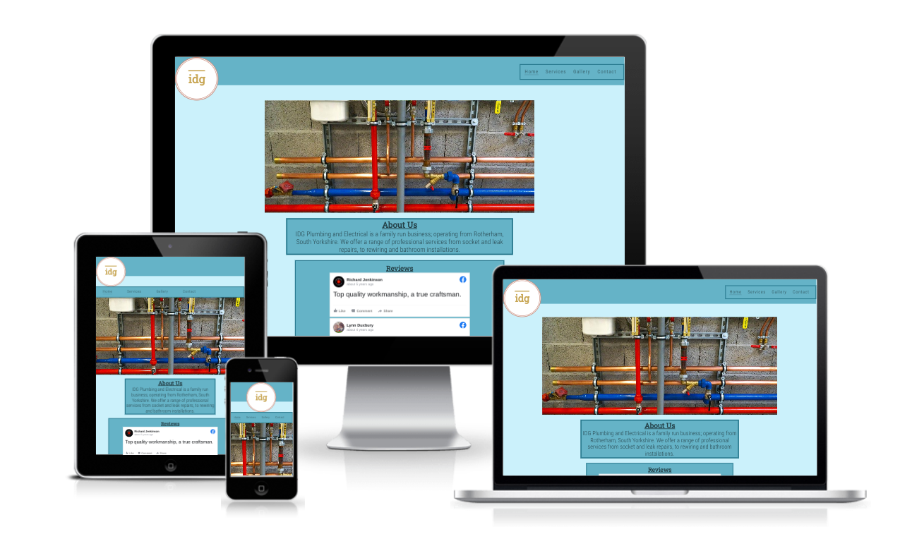

# IDG Plumbing and Electric

IDG Plumbing and Electric (IDG) is a small, family-run business operating in South Yorkshire, England.
This site will be used to promote and advertise the business to prospective users and clients and will provide information to them about the range of services the business offers.

(Developer: Stuart Wall)

[Live Website](https://clinelly.github.io/CI_PP1_IDG/)

## Table of Content

1. [Project Goals](#project-goals)
    1. [User Goals](#user-goals)
    2. [Site Owner Goals](#site-owner-goals)
2. [User Experience](#user-experience)
    1. [Target Audience](#target-audience)
    2. [User Requrements and Expectations](#user-requrements-and-expectations)
    3. [User Stories](#user-stories)
3. [Design](#design)
    1. [Design Choices](#design-choices)
    2. [Colour](#colours)
    3. [Fonts](#fonts)
    4. [Structure](#structure)
    5. [Wireframes](#wireframes)
4. [Technologies Used](#technologies-used)
    1. [Languages](#languages)
    2. [Frameworks & Tools](#frameworks-&-tools)
5. [Features](#features)
6. [Testing](#validation)
    1. [HTML Validation](#HTML-validation)
    2. [CSS Validation](#CSS-validation)
    3. [Accessibility](#accessibility)
    4. [Performance](#performance)
    5. [Device testing](#performing-tests-on-various-devices)
    6. [Browser compatibility](#browser-compatability)
    7. [Testing user stories](#testing-user-stories)
8. [Bugs](#Bugs)
9. [Deployment](#deployment)
10. [Credits](#credits)
11. [Acknowledgements](#acknowledgements)

## Project Goals

### User Goals
- Being able to find a local tradesman.
- Being able to see what services they provide.
- Being able to contact the tradesman quickly in case of an emergency.
- Being able to ask the business questions about prices. 
- Being able to see previous customer reviews and pictures of completed work.

### Site Owner Goals
- Being able to advertise the business.
- Being able to increase the number of customers.
- Being able to provide customers with an easy way to contact the business.
- Being able to explain to customers what services the business provides.
- Being able to show to customers what previous project have been completed.

## User Experience

### Target Audience 
### User Requrements and Expectations
### User Stories

## Design

### Design Choices
### Colour
### Fonts
### Structure
### Wireframes

## Technologies Used

### Languages
### Frameworks & Tools

## Features

## Testing

### HTML Validation
### CSS Validation
### Accessibility
### Performance
### Device testing
### Browser compatibility
### Testing user stories

## Bugs

## Deployment

## Credits

## Acknowledgements