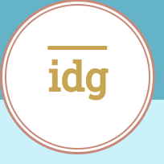

# IDG Plumbing and Electric

IDG Plumbing and Electric (IDG) is a small, family-run business operating in South Yorkshire, England.
This site will be used to promote and advertise the business to prospective users and clients and will provide information to them about the range of services the business offers.

(Developer: Stuart Wall)

[Live Website](https://clinelly.github.io/CI_PP1_IDG/)

## Table of Content

1. [Project Goals](#project-goals)
    1. [User Goals](#user-goals)
    2. [Site Owner Goals](#site-owner-goals)
2. [User Experience](#user-experience)
    1. [Target Audience](#target-audience)
    2. [User Requrements and Expectations](#user-requrements-and-expectations)
    3. [User Stories](#user-stories)
3. [Design](#design)
    1. [Design Choices](#design-choices)
    2. [Colour](#colours)
    3. [Fonts](#fonts)
    4. [Structure](#structure)
    5. [Wireframes](#wireframes)
4. [Technologies Used](#technologies-used)
    1. [Languages](#languages)
    2. [Frameworks & Tools](#frameworks-&-tools)
5. [Features](#features)
6. [Testing](#validation)
    1. [HTML Validation](#HTML-validation)
    2. [CSS Validation](#CSS-validation)
    3. [Accessibility](#accessibility)
    4. [Performance](#performance)
    5. [Device testing](#performing-tests-on-various-devices)
    6. [Browser compatibility](#browser-compatability)
    7. [Testing user stories](#testing-user-stories)
8. [Bugs](#Bugs)
9. [Deployment](#deployment)
10. [Credits](#credits)
11. [Acknowledgements](#acknowledgements)

## Project Goals

The ultimate goal of the project is to create a website for a small business and showcase their services; bringing them new customers and helping expand their business.

### User Goals
- Being able to find a local tradesman.
- Being able to see what services they provide.
- Being able to contact the tradesman quickly in case of an emergency.
- Being able to ask the business questions about prices. 
- Being able to see previous customer reviews and pictures of completed work.

### Site Owner Goals
- Being able to advertise the business.
- Being able to increase the number of customers.
- Being able to provide customers with an easy way to contact the business.
- Being able to explain to customers what services the business provides.
- Being able to show to customers what previous project have been completed.

## User Experience

### Target Audience 

- People who need a plumber/electrician in an emergency.
- People who are looking for a plumber/electrician to carry out routine or planned work.
- People who may be looking for inspiration or ideas for home improvements.
- Organisations who may be looking to contract a new tradesman.

### User Requrements and Expectations

### User Stories
The main service provided by IDG is a utility repair service. This means that there's some scope for expansion for the typical first-time/returning/frequent user stories. These could be expanded into emergency users, planned users, contracted users. These definitions are interchangeable and not mutually exclusive; a contracted user may be a first-time user but may actively be looking for similar key requirements that a frequent user would.
 
#### First Time Users / Emergency User
 
A first time user would be a user who is looking for utility work through a search engine and finds IDG's website, having never previously visited. An emergency user is someone who requires IDG's services in a time-sensitive manner. Therefore, their key requirements are:
 
1. To easily understand the main purpose of the site and learn more about the organisation.
2. To be easily able navigate throughout the site to find content.
3. To look for testimonials from other users and find out what they think of the service provider and see if they are trusted.
4. To locate their social media links to see the organisations' followings on social media to determine how trusted and known they are.
5. To quickly and easily contact the service provider and utilise their services.
 
#### Returning Users / Planned User
 
A returning user is likely to be a user who has used IDG's services and is returning for further work. A planned user is a user who has carried out previous research into the services they require before finding IDG, or be someone who has had IDG reccommended to them. Their key requirements are:

6. To find information about additional services.
7. To find the best way to get in contact with the organisation with any questions I may have.
8. To find ideas and inspirations.
 
#### Frequent User / Contract User
 
A frequent user is someone who utilises IDG's services on a regular basis. A contracted user could be an organisation that works alongside IDG or has them on their books. Their key requirements would be:

9. To check to see if the gallery has been updated with new work.
10. To check to see if there are any new reviews.
11. To be informed if the service provider is continuing to trade.

## Design

### Design Choices

The website was designed around the idea of a utility service. A monochrome scheme was used to attempt to convey a sense of modern professionalism; the colour choices and geometric shapes focus on the utilitarian aspect of the business.

### Colour

- For the colour scheme, I wanted to convey a sense of professionalism and a link to the plumbing aspect of the business. I chose a monochrome scheme, centered around a light blue background, with darker grey colours providing contrast for borders and text.

- During testing, it was found that the contrast between the text and background colours was not sharp enough; leading to accessibility problems. I put the main scheme back into the colour wheel and darkened it to provide a sharper text colour.

- Finally, I wanted the logo to 'pop' from the screen to catch the user's eye and highlight the electrical side of the business using contrasting, bright colours.

### Fonts

Roboto Slab was used for the headings and Roboto Condensed for the body. Sans Serif was chosen as a back-up font.
 
Roboto was chosen because it fit with the utilitarian asthetic of the website. Slab was used for the headings to provide greater definition over the Condensed body font.

### Structure

The website has a generic layout, used across the internet. This is to convey a sense of familiarity and prevent a frustrating user experience by having a complex, unfamiliar layout. The header contains the company logo in the top right of the screen, with a navigation bar in the top left. The main content is displayed in the main body in the centre of the screen. The footer is located at the bottom of the webpage and contains direct links to related external media.

The website has four pages:
- The Home page, which provides user with a basic outline about the company.
- The Services page, which goes into detail about what the company offers and what users can expect.
- The Gallery page, which provides users with images and pictures of what the company can provide and has accomplished in the past.
- The Contact page, which allows the user to provide their personal details and a detailed query to the company for a tailored response.

### Wireframes

## Technologies Used

### Languages

- HTML 
- CSS

### Frameworks & Tools

- Git
- GitHub
- GitPod
- Balsamiq
- Google Fonts
- Adobe Colour
- Font Awesome
- Favicon.io
- Google Chrome Developer Tools

## Features

This website consists of four pages and 12 features.

### Existing Features
 
**Logo**
 
The Logo in the top left of the page is an important advertisement of the company to the users. It is repeated across all the pages in a uniform location.

 
**Navigation Bar**
 
Located in the top left of the Home, Services, Gallery and Contact pages, the bar provides users with the ability to efficiently navigate the site to browse for relevant content. It also allows users to navigate backwards through the site without having to use the browser-based back button or keyboard shortcuts.

 
**Main Image**
 
The main images provide users with a visual representation of the type of services that IDG offers. This can reassure users that they are on the relevant website if they require a utilities service. The images are animated to shift between two pictures, providing visual feedback to the user.

 
**About Us**
 
A small paragraph that describes IDG. It provides users with information about IDG, the services it provides and the location it operates in.

 
**Reviews**
 
A number of positive reviews taken from IDG's Facebook page, providing users with real feedback from other users who have used IDG's services.

 
**Media Links**
 
Featured at the bottom of the page, throughout the website, a series of images provide users with links to external websites for their own research.
* Facebook: A link to IDG's Facebook page, featuring more reviews, pictures and updates.
* Email: Opens up a 'mail:to' link, direct to IDG's email account.
* Phone: Opens up a 'tel:' link to IDG's phone number - ideal for emergency users.
* Checkatrade: Opens up a link to IDG's Check'a'trade webpage.

 
**Our Services**
 
A small paragraph outlining IDG's services.

 
**Electrical and Plumbing Services**
 
An overview list of specific services available to users. Featured over relevant imagery to catch the user's attention.

 
**Electrical and Plumbing Services Pt.2**
 
A detailed breakdown of each service provided and a descriptive paragraph to help sell the service to the user, or help them match their specific requirement.
Provided in a display element to help reduce information overload and provide an element of interaction to the user.

 
**Gallery**
 
A gallery of photographs from jobs IDG has performed in the past. It is designed to show users the quality of work they can expect and to provide ideas and inspirations.

 
**Contact Form**
 
A form system where users can get in touch with IDG. Users will be able to describe their requirements, ask questions, arrange meetings or ask for job quotes.
Users will be asked to provide their names and contact information.

**Contact Details and Location**

A small section where the user can find the direct contact details for IDG, as well as their location on Google Maps.

### Features to be Implemented

## Testing

### HTML Validation

The W3C Markup Validation Service was used to check the validity of the HTML used across the website.
A number of errors were flagged; however, these were recorded as part of the Facebook code for the embedded reviews. No errors were shown with regard to my custom HTML.
Two warnings were flagged:
 - Sections lacking headings. These sections were used to house images as a background and did not require headings.
 - ARIA-Label. An ARIA-Label was placed on the contact links in the footer for accessibilty.

Home

Services

Gallery

Contact

### CSS Validation
### Accessibility
### Performance
### Device testing
 
Responsive testing was accomplished through the use of Google Chrome Dev Tools and active resizing of the viewport.
 
Amiresponsive? :

### Browser compatibility
### Testing user stories

## Bugs

## Deployment

The site was deployed to GitHub pages.
 
The steps followed to deploy it were:
In the GitHub repository, navigate to the Settings tab.
From the source section drop-down menu, select the Master Branch.
Once the master branch has been selected, the page will be automatically refreshed with a detailed ribbon display to indicate the successful deployment.
 
The live link can be found here - https://clinelly.github.io/CI_PP1_IDG/

## Credits

### Content

- Facebook Review iframes: taken from <a href="https://www.facebook.com/idgplumbingandelectrical/">Facebook</a> and the code was copied from Facebook's 'embed' feature.
- Icons: used for the external media links in the footer, and in the contact information. Taken from <a href="https://fontawesome.com/">FontAwesome.</a>
- Footer: code  modified from <a href="https://www.codeinstitute.com">CodeInsitute's</a> 'Love Running' project.
- Hero Image: animation code was modified by a blog by <a href="https://www.taniarascia.com/crossfade-between-two-images-with-css-animations/">Tania Rascia.</a> 
- Gallery: flexbox code and layout code modified from a <a href="https://stackoverflow.com/questions/39941941/order-of-items-with-column-count-property">StackOverflow</a> query.
- Google Maps iframe: taken from <a href="https://https://www.google.co.uk/maps">Google Maps</a> and the code was copied from Google Map's 'embed' feature.

### Media

**Hero Image**
- [consumer_board_testing](assets/images/consumer_board_testing.webp)Photo by:<a href="https://pixabay.com/users/jarmoluk-143740/"> Jarmoluk</a> Uploaded to:<a href="https://pixabay.com/">Pixabay</a>
- [water_pipes](assets/images/water_pipes.jpg)Photo by: <a href="https://pixabay.com/users/5317367-5317367/"> User 5317367</a> Uploaded to:<a href="https://pixabay.com/">Pixabay</a>

**Services Background**
- [plumbing_tools](assets/images/plumbing_tools.jpg)Photo by:<a href="https://pixabay.com/users/stevepb-282134/">Stevepb</a> Uploaded to:<a href="https://pixabay.com/">Pixabay</a>
- [electrician_tools](assets/images/electrician_tools.jpg)Photo by: <a href="https://pixabay.com/users/falconp4-6175978/">falconp4</a> Uploaded to:<a href="https://pixabay.com/">Pixabay</a>

**Gallery**
- [bathroom](assets/images/bathroom.webp)Photo by:<a href="https://pixabay.com/users/5460160-5460160/">User 5460160</a>
Uploaded to:<a href="https://pixabay.com/">Pixabay</a>
- [consumer_board](assets/images/consumer_board.jpg)Photo by: <a href="https://pixabay.com/users/image4you-2459255/">image4you</a> Uploaded to:<a href="https://pixabay.com/">Pixabay</a>
- [ev_charger_with_car](assets/images/ev_charger_with_car.jpg) Photo orginally taken from <a href="https://pixabay.com/">Pixabay</a> but has since been removed. Original artist unknown.
- [ev_charger](assets/images/ev_charger.jpg)Photo by:<a href="https://pixabay.com/users/hookyunglee-5559954/">hookyunglee</a> Uploaded to:<a href="https://pixabay.com/">Pixabay</a>
- [light_bulbs_library](assets/images/light_bulbs_library.jpg) Photo by: <a href="https://pixabay.com/users/stocksnap-894430/">stocksnap</a> Uploaded to:<a href="https://pixabay.com/">Pixabay</a>
- [light_bulbs](assets/images/light_bulbs.jpg)Photo by: <a href="https://pixabay.com/users/pexels-2286921/">pexels</a>
Uploaded to:<a href="https://pixabay.com/">Pixabay</a>
- [sink_tap](assets/images/sink_tap.jpg) Photo by: <a href="https://pixabay.com/users/krysmantovani-10901427/">krysmantovani</a> Uploaded to:<a href="https://pixabay.com/">Pixabay</a>
- [usb_sockets](assets/images/usb_sockets.jpg)Photo by: <a href="https://www.facebook.com/idgplumbingandelectrical/">IDG Plumbing and Electrical</a> Uploaded to:<a href="https://www.facebook.com/">Facebook</a>
- [bathroom_2](assets/images/bathroom_2.webp)Photo by:<a href="https://pixabay.com/users/jarmoluk-143740/"> Jarmoluk</a> Uploaded to:<a href="https://pixabay.com/">Pixabay</a>
- [bathroom_sink](assets/images/bathroom_sink.jpg) Photo by: <a href="https://pixabay.com/users/pexels-2286921/">pexels</a> Uploaded to:<a href="https://pixabay.com/">Pixabay</a>
- [lamp_outdoor](assets/images/lamp_outdoor.jpg) Photo by: <a href="https://pixabay.com/users/anders_mejlvang-19206329/"> Anders_Mejlvang </a> Uploaded to:<a href="https://pixabay.com/">Pixabay</a>
- [outdoor_tap](assets/images/outdoor_tap.jpg) Photo by: <a href="https://pixabay.com/users/jonaskim-7133458/">JonasKim</a> Uploaded to:<a href="https://pixabay.com/">Pixabay</a>
- [bathroom_3](assets/images/bathroom_3.jpg)Photo by: <a href="https://pixabay.com/users/midascode-2412635/">midascode</a> Uploaded to:<a href="https://pixabay.com/">Pixabay</a>
- [plug](assets/images/plug.jpg)Photo by:<a href="https://pixabay.com/users/stevepb-282134/">Stevepb</a> Uploaded to:<a href="https://pixabay.com/">Pixabay</a>
- [electric_wires](assets/images/electric_wires.jpg) Photo by: <a href="https://pixabay.com/users/taken-336382/">taken</a> Uploaded to:<a href="https://pixabay.com/">Pixabay</a>
- [garden-hose](assets/images/garden-hose.jpg)Photo by: <a href="https://pixabay.com/users/9436196-9436196/"> User 9436196</a> Uploaded to:<a href="https://pixabay.com/">Pixabay</a>

**Contact Form**
- [van](assets/images/van.jpg) Photo by: <a href="https://pixabay.com/users/publicdomainpictures-14/"> PublicDomainPictures</a> Uploaded to:<a href="https://pixabay.com/">Pixabay</a>

**404 Page**
- [electric-socket-disconnection-404-error](assets/images/electric-socket-disconnection-404-error.jpg) Image by: <a href="https://www.vecteezy.com/members/lucky-creative">Lucky Creative</a> Uploaded to: <a href="https://www.vecteezy.com/">Vecteezy</a>

## Acknowledgements